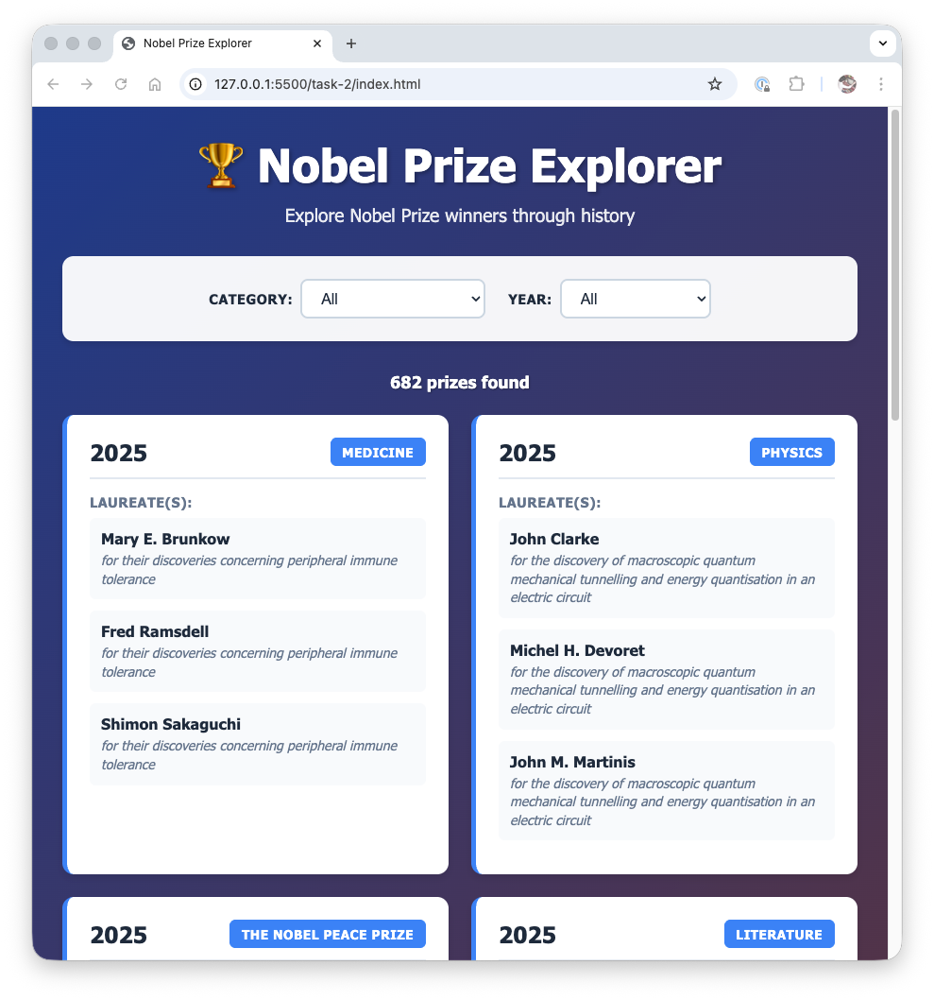
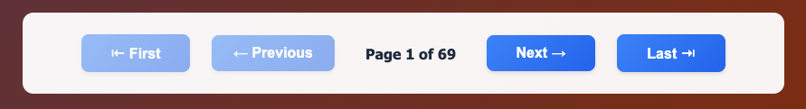
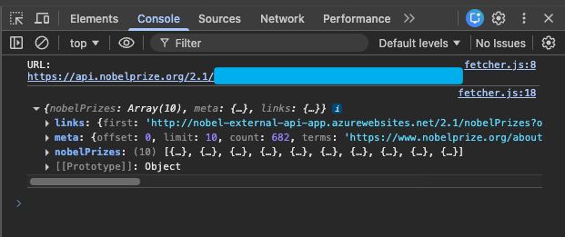

# Assignment Instructions

## Task 2 — Nobel Prizes Web App

For this task you will be using a pre-made Web application. Your job will be to complete the file `services.js` in the `task-2` folder that is responsible for fetching the data required for the application. The application uses the [NobelPrize API](https://www.nobelprize.org/about/developer-zone-2/) to display a list of awarded Nobel Prizes, optionally filtered by Nobel Prize **category** and award **year**. The exact steps are listed in the [Requirements](#requirements) section below — read through the background information first so you understand how everything fits together.

Here is what it looks like:



The list is paginated and there are buttons at the bottom to page through the list:



The API documentation **is** provided by the Nobel Prize organization in the Open API format. This interactive, standardized format enables you to directly try the API from the documentation website. The relevant Open API documentation for this task can be found here:

- https://app.swaggerhub.com/apis/NobelMedia/NobelMasterData/2.1

The only endpoint we will use is `GET /nobelPrizes`. The pre-made application features two dropdown boxes, one for selecting the Nobel Prize category and another one for selecting the Nobel Prize year. The dropdowns default to **All**, which means that no filtering will be done on the relevant criterion.

The provided `services.js` file that you need to complete looks like this:

```js
import { fetchData } from './fetcher.js';

const API_BASE_URL = 'https://api.nobelprize.org/2.1';

/**
 * Fetch Nobel Prizes with optional filters
 * @param {Object} filters - Filter options
 * @param {string} filters.year - Year to filter by (optional)
 * @param {string} filters.category - Category code to filter by (optional)
 * @param {number} filters.offset - Pagination offset (default: 0)
 * @param {number} filters.limit - Number of results per page (default: 10)
 * @param {Function} onSuccess - Callback for successful fetch
 * @param {Function} onError - Callback for fetch errors
 */
export function fetchNobelPrizes(filters = {}, onSuccess, onError) {
  let url = ''; // TODO Construct the full URL with query parameters;

  fetchData(url, onSuccess, onError);
}
```

The function `fetchNobelPrizes()` is called with three arguments:

1. A `filters` JavaScript object containing filter properties as set up by the web UI, depending on the state of the dropdowns and the pagination. This object is detailed later.
2. An `onSuccess` callback function.
3. An `onError` callback function.

Internally, the `fetchNobelPrizes()` function calls the imported `fetchData()` function, which takes a `url` as its first parameter, and the `onSuccess` and `onError` callbacks that are passed on to `fetchData()` unmodified.

For this exercise, you can consider the `fetchData()` function as a _black box_, i.e. you do not need to consider how it is implemented. The only thing you need to know is how to call it. In fact, the only thing that you need to do is to construct the full url that is needed to fetch the data given the filter values passed in the `filters` object. It may contain the following properties:

| **Field**                   | **Value**                                                                                                                           |
| --------------------------- | ----------------------------------------------------------------------------------------------------------------------------------- |
| year (string)               | The Nobel Prize year, or `"all"` if no year filter is selected.                                                                     |
| category (string)           | The Nobel Prize category, or `"all"` if no category filter is selected.                                                             |
| offset (number)             | An offset that indicates from which location in the list the current page starts. This offset is managed by the pagination buttons. |
| limit (number)              | The number of items per page. This is a fixed number, set by the Web UI.                                                            |

### Requirements

Complete the `fetchNobelPrizes()` function in `task-2/services.js` by constructing the full URL that will be passed to `fetchData()`. The URL must:

1. Use `https://api.nobelprize.org/2.1/nobelPrizes` as the base URL.
2. Include the `offset` query parameter, using the value from `filters.offset`.
3. Include the `limit` query parameter, using the value from `filters.limit`.
4. Include the `sort` query parameter, set to `desc` (this is **not** part of the `filters` object — you must add it yourself).
5. Include the `nobelPrizeYear` query parameter using the value from `filters.year`, but **only** when `filters.year` is not `"all"`.
6. Include the `nobelPrizeCategory` query parameter using the value from `filters.category`, but **only** when `filters.category` is not `"all"`.

> Tip: Use the [URLSearchParams](https://developer.mozilla.org/en-US/docs/Web/API/URLSearchParams) Web API to build the query string. It handles encoding and formatting for you.

### Running the application

A convenient way to run web application inside a project folder in VS Code is to use the Live Server VS Code extension. If not installed already, you can install it by typing “Live Server” in the extension explore in VS Code. Find the one authored by Ritwick Dey and click Install.

Alternatively, you can also install it from the VS Code Marketplace at this link: https://marketplace.visualstudio.com/items?itemName=ritwickdey.LiveServer

To run the finished web app in the browser, right-click the `index.html` file and select **Open with Live Server** from context menu.

When developing web application like the current one it is recommended to open the Developer Tools from the browser so that you can inspect the console for possible error messages. Check the table below for the short-cut key combination for your computer’s operation system.

| **Operating System** | **Shortcut Combination**        |
| -------------------- | ------------------------------- |
| **Windows**          | `F12` or `Ctrl` + `Shift` + `I` |
| **macOS**            | `Cmd` + `Option` + `I`          |
| **Linux**            | `F12` or `Ctrl` + `Shift` + `I` |

The pre-made web app will display the URL and the returned data in the Developer Tools console tab, as shown in this example (the exact URL has been hidden to not give away the solution for this task):



Try and change the Category and Year dropdown and verify that the app responds appropriately. Try the pagination buttons at the bottom of the page too.

### Running the Unit Tests

The unit tests for task 2 checks whether the URL is correctly constructed for various combinations of property values in the `filters` object. To run the unit test, use this command:

```bash
npm run test:task-2
```

If all is well you see output similar to this:

```
> core-assignment-week-9@1.0.0 test:task-2
> vitest --run tests/task-2.test.js

 RUN  v4.0.18 /path/to/core-assignment-week-9

 ✓ tests/task-2.test.js (8 tests) 7ms
   ✓ fetchNobelPrizes (8)
     ✓ Uses the correct base URL
     ✓ URL includes the nobelPrizeYear query parameter
     ✓ URL includes the nobelPrizeCategory query parameter
     ✓ URL includes the offset query parameter
     ✓ URL includes the limit query parameter
     ✓ Omits the nobelPrizeYear when set to "all"
     ✓ Omits the nobelPrizeCategory when set to "all"
     ✓ Includes the sort query parameter set to desc

 Test Files  1 passed (1)
      Tests  8 passed (8)
   Start at  16:35:08
   Duration  112ms (transform 11ms, setup 0ms, import 16ms, tests 7ms, environment 0ms)

```
